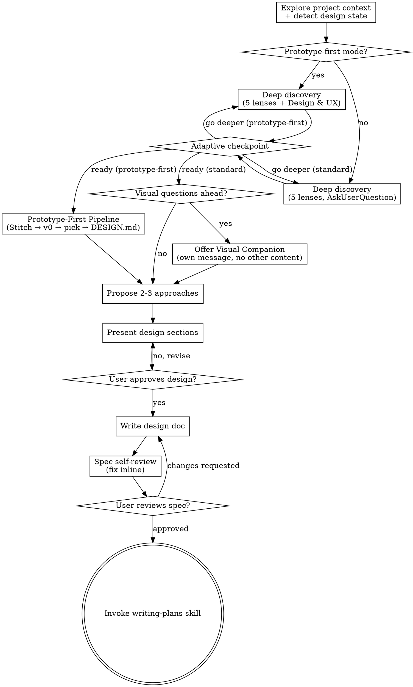

# Brainstorming Ideas Into Designs

Help turn ideas into fully formed designs and specs through natural collaborative dialogue.

Start by understanding the current project context, then discover the problem space deeply before designing a solution. Once you understand what you're building, present the design and get user approval.

## The Discovery Mindset

Every feature has an iceberg — what the user describes is 20%. The other 80% is failure modes, state edge cases, integration ripples, and scope that should have been cut. Before moving to approaches and design, surface that 80% through probing questions. Don't interview about speculative concerns — dig into the real friction points where this feature touches existing systems and where assumptions hide.

<HARD-GATE>
Do NOT invoke any implementation skill, write any code, scaffold any project, or take any implementation action until you have presented a design and the user has approved it. This applies to EVERY project regardless of perceived simplicity.
</HARD-GATE>

## Anti-Pattern: "This Is Too Simple To Need A Design"

Every project goes through this process. A todo list, a single-function utility, a config change — all of them. "Simple" projects are where unexamined assumptions cause the most wasted work. The design can be short (a few sentences for truly simple projects), but you MUST present it and get approval.

## Anti-Pattern: "I Think I Understand Enough"

Two rounds of questions doesn't mean discovery is done. If the feature is complex and you've only scratched the surface, say so before offering to move to approaches. The adaptive checkpoint exists so the user decides when discovery is sufficient — don't decide for them by moving on early.

## Checklist

You MUST create a task for each of these items and complete them in order:

1. **Explore project context** — check files, docs, recent commits
2. **Deep discovery** — use 5 lenses via AskUserQuestion, 1-2 focused questions per round
3. **Adaptive checkpoint** — summarize decisions and open questions, user decides to go deeper or proceed
4. **Visual step** — If prototype-first mode: run Prototype-First Pipeline (Stitch → v0 → pick → extract DESIGN.md). If non-greenfield with visual questions: offer Visual Companion. If no frontend: skip. See respective sections below.
5. **Propose 2-3 approaches** — with trade-offs and your recommendation
6. **Present design** — in sections scaled to their complexity, get user approval after each section
7. **Write design doc** — save to `docs/upp/specs/YYYY-MM-DD-<topic>-design.md` and commit
8. **Spec self-review** — quick inline check for placeholders, contradictions, ambiguity, scope (see below)
9. **User reviews written spec** — ask user to review the spec file before proceeding
10. **Transition to implementation** — invoke writing-plans skill to create implementation plan

## Process Flow



**The terminal state is invoking writing-plans.** Do NOT invoke frontend-design, mcp-builder, or any other implementation skill. The ONLY skill you invoke after brainstorming is writing-plans.

## The Process

**Understanding the idea:**

- Check out the current project state first (files, docs, recent commits)
- If there's no CLAUDE.md or the project is greenfield, say so — orient from what the user described and any files that do exist.
- Before asking detailed questions, assess scope: if the request describes multiple independent subsystems (e.g., "build a platform with chat, file storage, billing, and analytics"), flag this immediately. Don't spend questions refining details of a project that needs to be decomposed first.
- If the project is too large for a single spec, help the user decompose into sub-projects: what are the independent pieces, how do they relate, what order should they be built? Then brainstorm the first sub-project through the normal design flow. Each sub-project gets its own spec → plan → implementation cycle.
- For appropriately-scoped projects, ask questions one at a time to refine the idea. Prefer multiple choice questions when possible, but open-ended is fine too. Only one question per message — if a topic needs more exploration, break it into multiple questions. Focus on understanding: purpose, constraints, success criteria.

**Design state detection (prototype-first):**

After exploring project context, detect the design state to determine which brainstorming mode to use:

- Check `package.json` for react/next/vue/svelte/angular dependencies, `src/components/` or `app/` dirs, `tailwind.config.*`. For monorepos: also check `packages/*/package.json` and `apps/*/package.json`
- Check `git log --oneline -5` for commit count (≤5 = greenfield), or user states "new project"
- Check project root for `DESIGN.md`

Decision matrix:
- No frontend dependencies → standard brainstorming (no visual step)
- Frontend + `DESIGN.md` exists → standard brainstorming (Visual Companion available as today)
- Frontend + no `DESIGN.md` → **Prototype-First mode** (see Prototype-First Pipeline section below)

Announce the detected mode. Do not ask — state it:
- Greenfield: *"Greenfield [framework] project detected. No DESIGN.md. Frontend brainstorming will use prototype-first design: Stitch mood exploration → v0 prototypes in your stack → you pick in browser → DESIGN.md extracted from chosen prototype."*
- With DESIGN.md: *"DESIGN.md found (v[N]). Visual companion available for mockups during discovery."*
- No frontend: *"No frontend dependencies detected. Proceeding with standard brainstorming."*

User can override ("skip prototyping" / "I want prototyping anyway"), but the default is determined by project state.

**Deep discovery:**

For appropriately-scoped projects, explore through five lenses using AskUserQuestion (1-2 questions per round, 2-4 options per question, headers max 12 characters, labels 1-5 words):

- **Architecture:** State and data flow. Failure modes. Where this fits in the existing system. What happens when the happy path breaks.
- **UX:** Does the user's mental model match the implementation model? What happens on slow connections, mid-action? Undo and recovery. Accessibility.
- **Edge Cases:** Empty state. Data overflow. Mid-action abandonment. Concurrent edits. The scenarios nobody thinks about until production.
- **Scope:** The 50% cut test. Simplest valuable version. Explicit v1 boundaries. What you're deliberately NOT building.
- **Integration:** What existing code does this touch? What APIs change? What could this break? How do you test it? How do you roll it back?
- **Design & UX** (prototype-first mode only): Fires when detection identified prototype-first mode. Minimum 3 questions always fire for any frontend project. For agentic products (user mentions agents, AI, LLM, chat, JSON render), minimum 5 questions. This lens feeds the v0 prototype prompt, DESIGN.md Section 10, and Stitch mood direction — without it the pipeline generates blind.
  - **Q1 Visual Direction** (always): "What visual direction fits this product?" — reference a known product ("clean like Vercel", "dark like Linear") / describe a mood ("dark, dense, data-heavy") / "I'm not sure — show me options" (skill internally generates mood boards) / bring own reference (Figma URL, screenshot, website)
  - **Q2 Information Architecture** (always): "What does the user see first, and what's the primary action?" — dashboard-first / conversation-first / content-first / action-first. Follow-up: "What's in the sidebar/nav? What's secondary?" For agentic products (when Q3/Q4 also fire): "For significant agent output — code, documents, data tables — should it stay inline in the conversation or promote to a workspace/side panel? Inline is simpler. Workspace is better for content that will be iterated on. Threshold: content over ~15 lines or likely to be edited benefits from promotion."
  - **Q3 Data & Agent Output** (agentic products): "What types of content does the agent produce that the user sees?" — text responses / structured data / mixed rich content / actions & forms. Follow-up: "What states matter? Does content stream in? What does an error look like?"
  - **Q4 Interaction States** (agentic products): "How does the user experience waiting and errors?" — streaming reveal / skeleton→complete / progress indicator / optimistic. Follow-up: "What happens when the agent fails mid-response?"
  - **Q5 Responsive & Density** (always): "What's the density and primary device?" — desktop-dense / desktop-comfortable / mobile-first / responsive-equal
  The 3/5 question minimum is a floor, not a ceiling. Ask additional follow-ups when answers are ambiguous or raise new concerns.

Every question should make the user pause and think. If the answer is obvious, you've wasted a turn.

- Reference the user's previous answers — show you're building on what they said, not running through a checklist
- Push back gently: "What if..." / "Have you considered..."
- When the user seems uncertain, offer 2-3 options with tradeoffs
- Put your recommended option first with "(Recommended)" in the label

**Adaptive checkpoint (after round 3-4):**

Pause. Summarize the key decisions and open questions so far. Then ask via AskUserQuestion:
- "I have enough for approaches" (Recommended)
- "Go deeper on [specific area]"
- "Keep interviewing"

If the feature is complex and you've only scratched the surface, say so honestly before offering the options. This checkpoint is a gate, not a default exit.

**Exploring approaches:**

- Propose 2-3 different approaches with trade-offs
- Present options conversationally with your recommendation and reasoning
- Lead with your recommended option and explain why
- Before settling on an approach, apply the 50% cut test: if you had to cut half the scope, what survives? Name what's explicitly NOT in v1. Scope creep kills features before bad code does.

**Presenting the design:**

- Once you believe you understand what you're building, present the design
- Scale each section to its complexity: a few sentences if straightforward, up to 200-300 words if nuanced
- Ask after each section whether it looks right so far
- Cover: architecture, components, data flow, error handling, testing
- Be ready to go back and clarify if something doesn't make sense

**Design for isolation and clarity:**

- Break the system into smaller units that each have one clear purpose, communicate through well-defined interfaces, and can be understood and tested independently
- For each unit, you should be able to answer: what does it do, how do you use it, and what does it depend on?
- Can someone understand what a unit does without reading its internals? Can you change the internals without breaking consumers? If not, the boundaries need work.
- Smaller, well-bounded units are also easier for you to work with - you reason better about code you can hold in context at once, and your edits are more reliable when files are focused. When a file grows large, that's often a signal that it's doing too much.

**Working in existing codebases:**

- Explore the current structure before proposing changes. Follow existing patterns.
- Where existing code has problems that affect the work (e.g., a file that's grown too large, unclear boundaries, tangled responsibilities), include targeted improvements as part of the design - the way a good developer improves code they're working in.
- Don't propose unrelated refactoring. Stay focused on what serves the current goal.

## After the Design

**Documentation:**

- Write the validated design (spec) to `docs/upp/specs/YYYY-MM-DD-<topic>-design.md`
  - (User preferences for spec location override this default)
- Use elements-of-style:writing-clearly-and-concisely skill if available
- Commit the design document to git

**When prototype-first mode was used**, the spec output includes two additional sections:

**Design Artifacts section:**
```markdown
## Design Artifacts

### DESIGN.md (v1)
Location: `./DESIGN.md` (project root)
Extracted from: [chosen prototype name] during brainstorming
Sections: 1-11 (agentic) or 1-9 (non-agentic)
Authority: Design source of truth. All frontend implementation must read
Sections 2, 3, 4, 10 before writing components.

### Visual Baselines
Location: `./design-baselines/prototype/` (gitignored)
Captured at: 375px, 768px, 1280px from chosen prototype

### Reference Prototype
Location: `./app/design/[chosen]/` (gitignored)
Tagged in: `app/design/CHOSEN.md`

```

**UX Flows section** (lightweight, from 6th lens answers):
```markdown
## UX Flows

### Primary Flow
1. User lands on [Q2 primary view]
2. [Primary action] → [result/transition]
3. [Secondary actions available]

### Agent Interaction Flow (agentic products)
1. User triggers action / sends message
2. Agent responds with [Q3 types]
3. Streaming: [Q4 pattern]
4. Error: [recovery from Q4 follow-up]
5. User acts on output → [next step]

### Key States
- Empty: [what user sees before data]
- Loading: [what user sees while waiting]
- Error: [failure display + recovery action]
- Full: [representative data state]
```

These sections tell downstream skills (`writing-plans`, `executing-plans`) what design artifacts exist and where. The spec is the handoff document — downstream doesn't need to discover these artifacts.

**Spec Self-Review:**
After writing the spec document, look at it with fresh eyes:

1. **Placeholder scan:** Any "TBD", "TODO", incomplete sections, or vague requirements? Fix them.
2. **Internal consistency:** Do any sections contradict each other? Does the architecture match the feature descriptions?
3. **Scope check:** Is this focused enough for a single implementation plan, or does it need decomposition?
4. **Ambiguity check:** Could any requirement be interpreted two different ways? If so, pick one and make it explicit.

Fix any issues inline. No need to re-review — just fix and move on.

**User Review Gate:**
After the spec review loop passes, ask the user to review the written spec before proceeding:

> "Spec written and committed to `<path>`. Please review it and let me know if you want to make any changes before we start writing out the implementation plan."

Wait for the user's response. If they request changes, make them and re-run the spec review loop. Only proceed once the user approves.

**Implementation:**

- Invoke the writing-plans skill to create a detailed implementation plan
- Do NOT invoke any other skill. writing-plans is the next step.

## Key Principles

- **One question at a time** - Don't overwhelm with multiple questions
- **Be concrete, not abstract** - "If a user has 50 items and drags one while the connection drops..." forces a real decision. "What about scale?" gets a hand-wave.
- **Multiple choice preferred** - Easier to answer than open-ended when possible
- **YAGNI ruthlessly** - Remove unnecessary features from all designs
- **Explore alternatives** - Always propose 2-3 approaches before settling
- **Incremental validation** - Present design, get approval before moving on
- **Be flexible** - Go back and clarify when something doesn't make sense

## Prototype-First Pipeline (Greenfield Frontend)

Replaces Visual Companion for greenfield frontend projects (detected in step 1). When prototype-first mode is active, this pipeline runs as step 4 instead of the Visual Companion.

**When this section does NOT apply:** If detection did not identify prototype-first mode, skip this entirely and use the Visual Companion section below (or skip visuals if no frontend). This pipeline is ONLY for greenfield + frontend + no DESIGN.md.

**Async generation principle:** v0-sdk, Stitch MCP, and Figma capture all involve external generation that takes 1-3 minutes. MCP tool calls may time out — this is normal, NOT a failure. The generation continues on the provider's backend. Never retry on timeout. Instead, check the source for completion: poll Stitch with `get_screen(screenId)`, poll Figma with `generate_figma_design(captureId)`, check v0 output files.

**Keep the user in the loop — never go silent during generation.** The user should never be left wondering if something is stuck:
- **Immediately after dispatching:** Tell the user what's generating and give them a link to check: *"Generating mood boards via Stitch. You can check progress at https://stitch.withgoogle.com/projects/{projectId} — I'll also poll for completion."*
- **If the MCP call times out:** Tell the user: *"The generation is still running (MCP timed out, which is normal for 2-3 min generations). Here's the project/screen/capture ID: {id}. You can check [link] directly, or I'll keep polling."*
- **After ~2-3 minutes of polling without completion:** Proactively message: *"Still generating. You can check [link] to see if it's ready. Want to continue waiting, or should we move on with your verbal description instead?"*
- **After ~5 minutes:** Offer to skip: *"This is taking longer than usual. The generation may still complete at [link] — you can check later. Want to proceed with what we have, or describe the direction in words and I'll work from that?"*
- Never silently poll in a loop. Every check-in should give the user a link and an option to proceed without waiting.

### Mood Exploration (Step 4a)

**If user referenced a known product in Q1** ("like Stripe", "clean like Vercel"):
Use Stitch MCP to generate a custom interpretation inspired by that product. Prompt Stitch with the product's key aesthetic traits (e.g., "inspired by Stripe — deep navy headings, purple accent, light-weight elegant typography, white backgrounds"). This produces a custom design system tailored to the user's product, not a copy of the reference site's exact tokens.

**If user described a mood** ("dark, dense, data-heavy"):
Use the mood description directly as Stitch prompt context. Generate 2-3 variants interpreting that mood differently.

**If user wants to explore options** ("I'm not sure — show me options"):
Generate contrasting mood boards so the user can see real options and pick a direction.

**Stitch MCP workflow (all three paths above):**

1. `create_project` with a descriptive title (e.g., "[Product Name] — Mood Exploration"). One project per brainstorming session.
2. `generate_screen_from_text` for each mood variant. Key parameters:
   - `projectId`: from the project created in step 1
   - `prompt`: the mood description or reference-inspired prompt
   - `deviceType`: set from Q5 answer — desktop-dense/desktop-comfortable → `DESKTOP`, mobile-first → `MOBILE`, responsive-equal → `DESKTOP` for primary (generate a `MOBILE` variant too)
   - `modelId`: `GEMINI_3_FLASH` for speed, `GEMINI_3_1_PRO` for quality
3. **Generation is async** — it takes 2-3 minutes. The MCP call may time out. This is normal, NOT an error. If the call times out, the generation is still running on Stitch's backend. Poll with `get_screen` using the screen ID from the generation response (format: `projects/{projectId}/screens/{screenId}`) until `screenMetadata.status` is `COMPLETE`.
4. Each generated screen gets its own screen ID within the project. Track all screen IDs — use `get_screen(screenId)` for specific screens, not `list_screens` (unreliable for newly generated screens).
5. Share the Stitch project URL with the user: "I've generated some mood directions for you. View them at `https://stitch.withgoogle.com/projects/{projectId}` and tell me which direction resonates — or describe what you'd like to mix from different options."
6. When generation completes, extract a **mood summary** from the response for the v0 prompt. The full `designMd` is ~200 lines — too long for a CLI arg. Extract:
   - Creative direction (Section 1 of designMd, ~2-3 sentences describing the aesthetic philosophy)
   - Key colors (5-6 primary hex values from `namedColors`: primary, surface, accent, on_surface, outline)
   - Font name (from designMd Section 3)
   - Key rules (border-radius, shadow approach, spacing density — 2-3 bullet points)
   Assemble into a ~10 line mood string for the v0 `--mood` argument. Example: "Dark mode, near-black backgrounds (#131313), purple accent (#6d28d9), Inter with tight tracking (-0.02em), 4px border-radius, no shadows — use 1px borders for separation. High density, compact spacing."

**Stitch fallback:** If Stitch MCP is unavailable (not configured, API error, generation fails after polling), use the user's verbal description from Q1 as mood context directly in the v0 prompt. Describe the aesthetic in the v0 prompt yourself based on what the user said — "dark backgrounds, compact spacing, purple accent, monospace for data" is enough for v0 to work with. No external dependency needed. The pipeline never stalls at mood exploration.

**If user brought their own reference** (Figma URL, screenshot, website):
Use Figma MCP `get_design_context` to extract tokens from the Figma file, or analyze the screenshot/URL directly for visual direction. Extracted mood feeds into the v0 prompt.

### Prototype Generation (Step 4b)

Invoke the v0 global wrapper to generate 2-3 prototype variants:

```bash
node ~/.claude/scripts/v0-generate.mjs \
  --prompt "[rich prompt assembled from discovery]" \
  --mood "[mood description from 4a]" \
  --tailwind-config [path to project's tailwind.config if exists] \
  --components "[comma-separated installed shadcn components]" \
  --output ./app/design/prototype-a/
```

**Rich prompt construction** — assemble from 6th lens answers:
- Product type and design intent (from overall discovery)
- Visual direction (mood from 4a — reference excerpt or Stitch mood description)
- Primary view (Q2: dashboard / conversation / content / action)
- Agent output types (Q3, if agentic: text, tables, charts, action cards, etc.)
- Interaction pattern (Q4, if agentic: streaming / skeleton / progress / optimistic)
- Device and density (Q5: desktop-dense / desktop-comfortable / mobile-first / responsive-equal)
- Project's `tailwind.config` theme extract (colors, fonts if configured)
- Installed shadcn components list (from `npx shadcn@latest list` or `package.json` scan)
- Structure: "Generate hero section + primary feature area + component showcase"
- For agentic: "Include mock agent output renders for: [JSON types from Q3]"
- "Use real, representative content — not lorem ipsum"

Generate 2-3 variants with the same brief but different interpretation:
- Variant A: faithful to mood direction
- Variant B: creative interpretation of the same brief
- Variant C (optional): contrasting direction for comparison

**Full-auto adapt** each v0 response to the project stack:
- Map hardcoded hex colors → project CSS custom properties (create vars if none exist)
- Verify shadcn component imports resolve; run `npx shadcn@latest add [missing]` for any missing
- Fix import paths to match project conventions (`@/components/ui/` etc.)
- Write to `app/design/prototype-a/page.tsx`, `prototype-b/page.tsx`, `prototype-c/page.tsx`
- Add `app/design/` to `.gitignore` if not present
- **Verify prototypes render:** After writing each prototype, check that the dev server serves it without errors. Navigate to the URL and confirm it loads. If there are compile errors (missing imports, type errors), fix them before presenting to the user. The user should never see a broken prototype.

**Anti-slop during adaptation** — the prototype must feel intentionally designed, not generically AI-generated:
- Typography: distinctive fonts only. Never Inter, Roboto, Arial. Pair a display font with a body font.
- Color: dominant colors with sharp accents. No timid, evenly-distributed palettes. No purple-gradient-on-white.
- Layout: intentional composition. Asymmetry, overlap, grid-breaking elements where they serve the design.
- Every design should feel context-specific and chosen for the product, not defaulted.

### User Reviews in Browser (Step 4c)

**Dev server check:** Before presenting prototypes, verify the dev server is running. Check if `localhost:3000` (or the project's configured port) responds. If not running:
1. Start it: `npm run dev` in background (non-blocking)
2. Wait up to 15 seconds for server ready
3. If start fails, prompt user: "Start your dev server (`npm run dev`) and let me know when it's ready."

Present prototype URLs to the user:
```
Dev server running at localhost:3000.

View prototypes:
  → localhost:3000/design/prototype-a
  → localhost:3000/design/prototype-b
  → localhost:3000/design/prototype-c

Which direction do you prefer? You can pick one,
mix elements from multiple, or ask for changes.
```

User responds with selection and feedback.

**If user requests changes** to a prototype before choosing: use the v0 wrapper's `chatId` (returned from generation) with `v0.chats.sendMessage({ chatId, message: "[user's requested changes]" })` to iterate on the specific prototype. Re-adapt and re-verify. If changes are minor (color tweak, text change), edit the prototype files directly without re-invoking v0.

### Tag Chosen Prototype (Step 4d)

Create `app/design/CHOSEN.md`:
```markdown
prototype: prototype-b
feedback: "B's layout but with A's color palette"
date: YYYY-MM-DD
```

If user requests mixing elements from multiple prototypes, merge the requested elements into `app/design/prototype-final/page.tsx`. That becomes the chosen prototype.

All prototypes stay in `app/design/` (gitignored). No cleanup. The chosen one is tagged.

### DESIGN.md Extraction (Step 4e)

Read the chosen prototype's source files. You wrote them (or adapted them from v0), so you know every class, every variable, every pattern. Produce DESIGN.md sections 1-9 from what's actually in the code:

- **Section 1 (Theme & Atmosphere):** Overall aesthetic assessment — mood, density, design philosophy
- **Section 2 (Color Palette):** Extract every Tailwind color class and CSS custom property. Map to semantic roles (primary, background, secondary, border, accent, muted)
- **Section 3 (Typography):** Font imports, `text-*` sizes, `tracking-*` values, `leading-*` values, `font-*` weights. Build the full type hierarchy table
- **Section 4 (Component Styles):** Button/card/input/nav patterns: `rounded-*`, `p-*`, `border-*`, shadow classes, hover/focus states
- **Section 5 (Layout):** Spacing scale (`gap-*`, `p-*`, `m-*`), grid/flex patterns, `max-w-*`, whitespace philosophy
- **Section 6 (Depth & Elevation):** `shadow-*` classes, `ring-*` utilities, `z-*` patterns, surface hierarchy
- **Section 7 (Do's/Don'ts + Content Voice):** Derive guardrails from the aesthetic. Add content voice patterns:
  ```
  ### Content Patterns
  - Buttons: verb + noun, sentence case ("Save changes", not "SAVE")
  - Errors: what happened + what to do ("Connection lost. Retrying...")
  - Empty states: explain + action ("No results yet. Create your first →")
  - Loading: present tense ("Loading projects...")
  - Tooltips: max 12 words, no period
  ```
- **Section 8 (Responsive):** Breakpoint usage (`sm:` / `md:` / `lg:`), responsive patterns, touch target sizing, collapsing strategy
- **Section 9 (Agent Prompt Guide):** Quick reference for colors, fonts, spacing — ready-to-paste values

For agentic products, add:
- **Section 10 (Agent Render System):** Written from 6th lens Q3/Q4 answers, NOT from prototype code. Use this template:
  ```
  ## 10. Agent Render System

  ### Component Registry
  | JSON Type | Component | Key Props | States |
  |-----------|-----------|-----------|--------|
  | [from Q3] | [named]   | [identified] | [select from vocabulary] |

  States to consider for each component type (select which apply):
  idle, loading, streaming, complete, error, empty,
  tool-calling, awaiting-approval, rate-limited, context-exceeded
  Q4 informs the streaming UX strategy. This vocabulary defines the full
  set of states each type might need. Not all types need all states.

  ### Prop Validation
  Validate props at render time using Zod schemas or TypeScript runtime checks.
  Agent output must match expected prop shapes before reaching components.
  Malformed output → render fallback component instead of crashing.
  This catches bad props on KNOWN types. The fallback renderer catches UNKNOWN types.

  ### Composition Rules
  - Components render in document order from agent output array
  - Adjacent same-type components merge
  - Sections group related components with shared header
  - Max nesting: 3 levels (section → card → component). Deeper nesting causes rendering issues during streaming and cognitive overload

  ### Streaming Behavior
  - [streaming pattern from Q4]
  - Error: error card with retry, shows last good state

  ### Fallback Rendering
  - Unknown JSON type → GenericCard (type name as title, JSON as code block)
  - Malformed JSON → ErrorCard with raw content
  - Null/empty → EmptyState with type-appropriate message
  ```
- **Section 11 (Motion & Transitions):** Standard template:
  ```
  ## 11. Motion & Transitions

  ### Timing
  - Default: 200ms | Complex: 300ms | Page: 400ms
  - Easing: cubic-bezier(0.4, 0, 0.2, 1)
  - Entry: cubic-bezier(0, 0, 0.2, 1) | Exit: cubic-bezier(0.4, 0, 1, 1)

  ### Streaming Patterns
  - Skeleton → content: opacity 0→1, 300ms
  - Character reveal: 30ms per char
  - Progressive list: stagger 50ms per item

  ### Rules
  - Only animate transform and opacity
  - Respect prefers-reduced-motion
  - will-change only on elements about to animate
  ```

Version as `v1`. Write to project root as `DESIGN.md`. The version field is consumed by Layer 2 hooks and should increment on any future updates.

### Figma MCP Enrichment (Step 4f)

After DESIGN.md extraction, validate and enrich using Figma MCP:

1. `generate_figma_design` — capture the chosen prototype's live page at localhost → pushes to Figma as editable layers. Call without outputMode first to get a captureId and instructions. Then inject `<script src="https://mcp.figma.com/mcp/html-to-design/capture.js" async></script>` into the prototype's HTML, open the localhost URL with capture hash params (`#figmacapture={captureId}&figmaendpoint=...`). Poll with `generate_figma_design(captureId)` until status is `completed`. This is the LOCAL capture method — Playwright is not needed for localhost pages.
2. `get_design_context` on the captured Figma file — returns React/Tailwind reference code, a screenshot, and exact design tokens (fonts, colors, spacing, shadows, border-radius) extracted from the rendered design. Use the fileKey from the completed capture and the main frame nodeId from `get_metadata`.
3. Compare Figma-extracted tokens against the DESIGN.md draft. Specifically check:
   - Colors: do hex values in the Figma code match DESIGN.md Section 2? (computed colors from `color-mix()` or CSS vars may resolve differently)
   - Typography: do rendered font sizes/weights match Section 3's hierarchy table?
   - Spacing: do actual pixel values in Figma's code match the Tailwind spacing scale in Section 5?
   - Shadows/borders: do Figma's rendered shadows match Section 6?
4. Resolve discrepancies: code-first values are primary (you read the source). Update DESIGN.md only where Figma reveals a computed value that differs from what Tailwind classes suggest (e.g., `color-mix()` resolves to a different hex than expected, or a responsive breakpoint changes the rendered layout).

This step is enrichment, not replacement. If Figma MCP is unavailable (rate limited, not configured), the DESIGN.md from code-first extraction stands on its own.

### Playwright Baseline Capture (Step 4g)

Capture the chosen prototype at three breakpoints:
- 375px (mobile)
- 768px (tablet)
- 1280px (desktop)

Store screenshots in `design-baselines/prototype/` (gitignored). Namespaced separately from `design-baselines/golden-samples/` which Layer 3 will use later.

After this step, return to the normal brainstorming flow — step 5 (propose approaches) continues as usual, now with DESIGN.md as additional context.

## Visual Companion

A browser-based companion for showing mockups, diagrams, and visual options during brainstorming. Available as a tool — not a mode. Accepting the companion means it's available for questions that benefit from visual treatment; it does NOT mean every question goes through the browser.

**Offering the companion:** When you anticipate that upcoming questions will involve visual content (mockups, layouts, diagrams), offer it once for consent:
> "Some of what we're working on might be easier to explain if I can show it to you in a web browser. I can put together mockups, diagrams, comparisons, and other visuals as we go. This feature is still new and can be token-intensive. Want to try it? (Requires opening a local URL)"

**This offer MUST be its own message.** Do not combine it with clarifying questions, context summaries, or any other content. The message should contain ONLY the offer above and nothing else. Wait for the user's response before continuing. If they decline, proceed with text-only brainstorming.

**Per-question decision:** Even after the user accepts, decide FOR EACH QUESTION whether to use the browser or the terminal. The test: **would the user understand this better by seeing it than reading it?**

- **Use the browser** for content that IS visual — mockups, wireframes, layout comparisons, architecture diagrams, side-by-side visual designs
- **Use the terminal** for content that is text — requirements questions, conceptual choices, tradeoff lists, A/B/C/D text options, scope decisions

A question about a UI topic is not automatically a visual question. "What does personality mean in this context?" is a conceptual question — use the terminal. "Which wizard layout works better?" is a visual question — use the browser.

If they agree to the companion, read the detailed guide before proceeding:
`skills/brainstorming/visual-companion.md`

## Aesthetic Guidance (Prototype-First)

Applied during v0 prompt construction and DESIGN.md extraction when prototype-first mode is active. These principles prevent generic "AI slop" output and ensure every prototype feels intentionally designed:

**Typography:** Distinctive fonts only. Never Inter, Roboto, Arial, system fonts. Pair a characterful display font with a refined body font.
**Color:** Dominant colors with sharp accents. No timid, evenly-distributed palettes. No purple-gradient-on-white. Commit to a cohesive palette.
**Layout:** Asymmetry, overlap, grid-breaking elements. Not predictable centered layouts. Generous negative space OR controlled density — choose one and commit.
**Motion:** One high-impact animation moment, not scattered micro-interactions. Page load stagger > hover effects.
**Anti-slop:** No generic AI aesthetics. Every design must feel context-specific — designed FOR this product, not defaulted BY a model.

These inform:
- v0 prompt style direction (explicit anti-slop instructions in the prompt prevent v0 from generating generic output)
- DESIGN.md Section 1 (Theme & Atmosphere) quality standard
- DESIGN.md Section 7 (Do's/Don'ts) content
