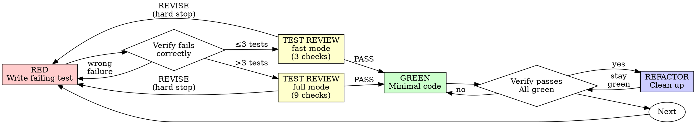

# Test-Driven Development (TDD)

## Overview

Write the test first. Watch it fail. Write minimal code to pass.

**Core principle:** If you didn't watch the test fail, you don't know if it tests the right thing.

TDD is a design technique, not just a testing technique. Writing the test first forces you to design the interface from the consumer's perspective — before you think about internals. Hard-to-test code is a design signal, not a testing problem.

**Violating the letter of the rules is violating the spirit of the rules.**

## When to Use

**Always:**
- New features
- Bug fixes
- Refactoring
- Behavior changes

**Exceptions (ask your human partner):**
- Throwaway prototypes
- Scaffolding output (create-next-app, npx init — not AI-written code)
- Configuration files

Thinking "skip TDD just this once"? Stop. That's rationalization.

## Test Behaviors, Not Implementations

This is the #1 thing that separates useful TDD from wasted TDD. Tests coupled to implementation details break every time you refactor — and then you stop refactoring, and then you stop doing TDD, and then quality collapses.

**Test what the code DOES, not how it does it.**

| Testing behavior (DO) | Testing implementation (DON'T) |
|----------------------|-------------------------------|
| "returns user when email is valid" | "calls database.query with SELECT * FROM users" |
| "retries 3 times on failure" | "calls setTimeout between retries" |
| "renders error message on invalid input" | "sets state.error to true" |
| "sends notification when order completes" | "calls notificationService.send with specific args" |

**The boundary test:** If you refactored the internals without changing the behavior, would your test break? If yes — you're testing implementation. Rewrite it.

**For frontend components:** Test what the user sees and does, not the component's internal state. Assert on rendered output, accessible roles, visible text — not on state variables, hook calls, or DOM structure.

**When DESIGN.md exists:** Component tests should assert against design tokens (semantic color names, font size variables) — not hardcoded hex values. The design system is a behavioral contract.

## Chicago-School TDD (UPP's Stance)

<HARD-GATE>
UPP is explicit: tests exercise real code through real boundaries. We are Chicago-school, not London-mockist. This stance governs every mocking decision in this codebase.
</HARD-GATE>

**Mockist (London)**: mock every collaborator, test the unit in isolation. Fast. Prevents test drift from implementation. Risks: self-fulfilling mocks, tests decoupled from the real system, "1470 mock tests pass, production broken."

**Classical (Chicago)**: instantiate real collaborators where possible, mock only truly external / slow I/O (network to third-parties, filesystem, time). Tests describe behavior through real interactions. Risks: slower; requires thoughtful test data setup.

Research convergence (Meta Autonomous Testing; MockMill study arXiv:2604.19315; MSR '26 agent-mock study — agents add mocks at 36% vs. human commits at 26%; Freeman & Pryce *Growing Object-Oriented Software, Guided by Tests*): Chicago produces more faithful tests. LLM agents trained on both traditions default to mock-heavy unless instructed otherwise — the skill makes the stance explicit so the agent stops defaulting.

See **Testing Through the Production Boundary** below for mechanics.

## Testing Through the Production Boundary

<HARD-GATE>
Integration and end-to-end tests MUST exercise the same boundary real clients hit in production. Do NOT author an integration or e2e test by importing a handler and calling it directly — that is a unit-test pattern wearing integration clothing.
</HARD-GATE>

The #1 cause of Pattern-3-style failures (mock tests that pass while the real system is broken) is testing the handler by importing it and calling it directly, rather than exercising the real protocol or transport.

**The rule**: integration and end-to-end tests must exercise the SAME boundary that real clients hit in production.

| Production surface | Wrong (common LLM pattern) | Right (through the boundary) |
|--------------------|---------------------------|-----------------------------|
| HTTP API | `import { handler } from './api'; handler(req)` | Start the server on an ephemeral port, `fetch('http://localhost:PORT/path')` |
| MCP server (stdio) | `import { server } from './mcp'; server.callTool(...)` | Spawn the server process, write framed JSON-RPC to stdin, read from stdout |
| MCP server (SSE/HTTP) | same | Real HTTP/SSE client against a running server |
| CLI | `import { main } from './cli'; main(args)` | `spawnSync('./bin/cli', args)` |
| Framework-registered hook (e.g., Claude Code hook) | Import and invoke | Execute the plugin/hook through the real event trigger |

This is the principle behind Freeman & Pryce's *Growing Object-Oriented Software, Guided by Tests* ("test through the public API"). In the LLM era, it is the strongest single guard against hollow test suites.

**Mock policy in integration / e2e tests**: zero mocks of local collaborators. Mocks are permitted only for external services that are genuinely unreachable (third-party APIs not available in test env). For those, prefer Testcontainers (databases, message brokers, Redis), LocalStack (AWS), MinIO (S3-compatible), or real staging endpoints under `[test-only]` feature flags.

**Enforcement**: the test-reviewer agent's Check 4 (Mock Quality) applies a per-test path heuristic — any mock of a local collaborator in a test that actually crosses a production boundary gets flagged **MOCK-IN-E2E**. Self-fulfilling mocks double-fire in Check 8 (WEAK ORACLE). Teams wanting commit-time prevention can add their own `ban-mocks-in-e2e` ESLint rule or pre-commit hook — UPP does not ship one in v2 because no foolproof static detector exists (path-based, import-based, and annotation-based all have structural false-positive / false-negative problems).

**Escape hatch**: developers can annotate a legitimate mock as `// test-discipline: allow-mock reason:<justification>`. The reviewer sees the annotation and suppresses the flag for that specific test.

## The Iron Law

```
NO PRODUCTION CODE WITHOUT A FAILING TEST FIRST
```

Write code before the test? Delete it. Start over.

**No exceptions:**
- Don't keep it as "reference"
- Don't "adapt" it while writing tests
- Don't look at it
- Delete means delete

Implement fresh from tests. Period.

## Red-Green-Refactor



### RED - Write Failing Test

Write one minimal test showing what should happen.

#### Spec Connection (when available)

If brainstorming produced a spec, read it before writing tests. Each spec requirement becomes at least one test case. The spec tells you WHAT to test. TDD tells you HOW.

<Good>
```typescript
test('retries failed operations 3 times', async () => {
  let attempts = 0;
  const operation = () => {
    attempts++;
    if (attempts < 3) throw new Error('fail');
    return 'success';
  };

  const result = await retryOperation(operation);

  expect(result).toBe('success');
  expect(attempts).toBe(3);
});
```
Clear name, tests real behavior, one thing
</Good>

<Bad>
```typescript
test('retry works', async () => {
  const mock = jest.fn()
    .mockRejectedValueOnce(new Error())
    .mockRejectedValueOnce(new Error())
    .mockResolvedValueOnce('success');
  await retryOperation(mock);
  expect(mock).toHaveBeenCalledTimes(3);
});
```
Vague name, tests mock not code
</Bad>

**Requirements:**
- One behavior
- Clear name
- Real code (no mocks unless unavoidable)

### Verify RED - Watch It Fail

**MANDATORY. Never skip.**

```bash
npm test path/to/test.test.ts
```

Confirm:
- Test fails (not errors)
- Failure message is expected
- Fails because feature missing (not typos)

**Test passes?** You're testing existing behavior. Fix test.

**Test errors?** Fix error, re-run until it fails correctly.

### Test-Reviewer Gate (after RED, before GREEN)

<HARD-GATE>
The test-reviewer gate is mandatory for every test suite of any size. Do NOT invoke Bash with a test runner, do NOT invoke git commit, do NOT claim GREEN until the appropriate reviewer agent has been dispatched and returned PASS verdict. This gate is non-skippable.
</HARD-GATE>

After writing your failing tests for a task, dispatch the test-reviewer agent to review them before implementing.

**Why a separate agent, not self-review:** You wrote the test. You already have an implementation in mind. You CANNOT objectively evaluate whether your test is weak — the same thinking that produced the test evaluates it. A fresh-context agent has no implementation bias. It sees only the test.

**Which agent to dispatch:**
- For suites of **≤3 tests** → dispatch `test-reviewer-fast` (runs Checks 6, 7, 8 — the three checks where a single test can still be catastrophically wrong).
- For suites of **>3 tests** → dispatch `test-reviewer` (runs all 9 checks).

A 1-test file can still be UNWIRED, UNVERIFIED, or have a WEAK ORACLE. Size does not correlate with quality in LLM-written tests — if anything, inverse: small suites are more often happy-path-only and shape-only (MSR '26 data).

**Dispatch bundle**: use the Agent tool with `subagent_type: test-reviewer` or `test-reviewer-fast`. Include:
- **Test file(s)** content
- **Spec / task description** (what the tests should cover)
- **SUT source file(s)** — the production code being tested
- **Entry-point hint** — e.g., "HTTP API at src/api/routes.ts", "MCP server registered in src/mcp.ts", "CLI dispatched from bin/cli"
- Any relevant type definitions or interfaces

When you cannot provide SUT source or entry-point hint, the reviewer degrades gracefully: it emits `INSUFFICIENT CONTEXT` at the top and flags which checks were weakened. The review still runs.

**The agent checks** (full reviewer runs all 9; fast-mode runs Checks 6/7/8):
1. Trivial Pass — could a hardcoded-return implementation pass?
2. Behavior vs Implementation — asserts on observable vs internal state
3. Edge Case + Error-Path Parity — empty/null/boundary + every catch/throw tested
4. Mock Quality — self-fulfilling detection + per-test path heuristic
5. Spec Alignment — every requirement has a test
6. Production Call-Site — public methods reached via production entry point
7. Description-Behavior Correspondence — every claim has a behavior assertion
8. Oracle Strength — shape-only, self-fulfilling (double-flag), tautological, assertion-free, trivially-passable
9. Lifecycle / Workflow Coverage — always runs, N/A for stateless

**If the agent flags issues:** Fix the tests before proceeding to GREEN. Do NOT implement against weak tests — you'll build false confidence.

**REVISE verdict = full stop (G5).** You do NOT proceed to GREEN with open CRITICAL findings.
- Return to RED — fix the flagged tests
- Re-verify they fail correctly
- Re-dispatch the reviewer
- Only when the reviewer returns PASS do you proceed

Writing production code against REVISE-flagged tests is the equivalent of ignoring a failing lint rule. Do not.

**When to skip:** Never. Small suites use fast-mode; large suites use full. No bypass.

### GREEN - Minimal Code

Write simplest code to pass the test.

<Good>
```typescript
async function retryOperation<T>(fn: () => Promise<T>): Promise<T> {
  for (let i = 0; i < 3; i++) {
    try {
      return await fn();
    } catch (e) {
      if (i === 2) throw e;
    }
  }
  throw new Error('unreachable');
}
```
Just enough to pass
</Good>

<Bad>
```typescript
async function retryOperation<T>(
  fn: () => Promise<T>,
  options?: {
    maxRetries?: number;
    backoff?: 'linear' | 'exponential';
    onRetry?: (attempt: number) => void;
  }
): Promise<T> {
  // YAGNI
}
```
Over-engineered
</Bad>

Don't add features, refactor other code, or "improve" beyond the test.

### Verify GREEN - Watch It Pass

**MANDATORY.**

```bash
npm test path/to/test.test.ts
```

Confirm:
- Test passes
- Other tests still pass
- Output pristine (no errors, warnings)

**Test fails?** Fix code, not test.

**Other tests fail?** Fix now.

### REFACTOR - Clean Up (Don't Skip This)

This is where TDD pays off. You have green tests. Now improve the code WITH CONFIDENCE — the tests catch any break.

Skipping this step is the most common way TDD degrades into "messy code with tests."

**Do:**
- Remove duplication (same pattern for multiple tests? extract it)
- Improve names (now that you understand what the code does)
- Extract helpers (function grew during GREEN? break it apart)
- Simplify conditionals (if-else chains → early returns, guard clauses)

**Don't:**
- Add new behavior (that's a new RED cycle)
- "Improve" code that isn't related to what you just built
- Refactor tests and production code at the same time (one, then the other)

**Keep tests green throughout.** Run after every refactor step. If a test breaks, your refactor changed behavior — undo and try again.

### Repeat

Next failing test for next feature.

## Good Tests

| Quality | Good | Bad |
|---------|------|-----|
| **Minimal** | One thing. "and" in name? Split it. | `test('validates email and domain and whitespace')` |
| **Clear** | Name describes behavior | `test('test1')` |
| **Shows intent** | Demonstrates desired API | Obscures what code should do |

## Why Order Matters

Tests-first forces you to see the test fail, proving it actually tests something. Tests-after pass immediately — which proves nothing about what they detect.

Four common rationalizations for writing tests after ("I'll test later", "manual testing is enough", "deleting code feels wasteful", "pragmatic > dogmatic") all collapse on scrutiny. See the **Common Rationalizations** table below for each, plus the reasoning that refutes them.

## Common Rationalizations

| Excuse | Reality |
|--------|---------|
| "Too simple to test" | Simple code breaks. Test takes 30 seconds. |
| "I'll test after" | Tests passing immediately prove nothing. |
| "Tests after achieve same goals" | Tests-after = "what does this do?" Tests-first = "what should this do?" |
| "Already manually tested" | Ad-hoc ≠ systematic. No record, can't re-run. |
| "Deleting X hours is wasteful" | Sunk cost fallacy. Keeping unverified code is technical debt. |
| "Keep as reference, write tests first" | You'll adapt it. That's testing after. Delete means delete. |
| "Need to explore first" | Fine. Throw away exploration, start with TDD. |
| "Test hard = design unclear" | Listen to test. Hard to test = hard to use. |
| "TDD will slow me down" | TDD faster than debugging. Pragmatic = test-first. |
| "Manual test faster" | Manual doesn't prove edge cases. You'll re-test every change. |
| "Existing code has no tests" | You're improving it. Add tests for existing code. |
| "This suite is small, skip the reviewer" | Small suites get fast-mode review (Checks 6/7/8), still mandatory. MSR '26 data shows small suites are MORE often hollow, not less. The "small = safe" heuristic has zero empirical support. |

## Red Flags - STOP and Start Over

- Code before test
- Test after implementation
- Test passes immediately
- Can't explain why test failed
- Tests added "later"
- Rationalizing "just this once"
- "I already manually tested it"
- "Tests after achieve the same purpose"
- "It's about spirit not ritual"
- "Keep as reference" or "adapt existing code"
- "Already spent X hours, deleting is wasteful"
- "TDD is dogmatic, I'm being pragmatic"
- "This is different because..."

**All of these mean: Delete code. Start over with TDD.**

## Example: Bug Fix

**Bug:** Empty email accepted

**RED**
```typescript
test('rejects empty email', async () => {
  const result = await submitForm({ email: '' });
  expect(result.error).toBe('Email required');
});
```

**Verify RED**
```bash
$ npm test
FAIL: expected 'Email required', got undefined
```

**GREEN**
```typescript
function submitForm(data: FormData) {
  if (!data.email?.trim()) {
    return { error: 'Email required' };
  }
  // ...
}
```

**Verify GREEN**
```bash
$ npm test
PASS
```

**REFACTOR**
Extract validation for multiple fields if needed.

## Verification Checklist

Before marking work complete:

- [ ] Every new function/method has a test
- [ ] Watched each test fail before implementing
- [ ] Each test failed for expected reason (feature missing, not typo)
- [ ] Wrote minimal code to pass each test
- [ ] All tests pass
- [ ] Output pristine (no errors, warnings)
- [ ] Tests use real code (mocks only if unavoidable)
- [ ] Tests assert behaviors, not implementation details
- [ ] Edge cases and errors covered
- [ ] Test-reviewer (fast or full per suite size) dispatched. Paste the agent's summary block here:

      Mode: [fast|full] (N tests, M checks)
      CRITICAL: N  MAJOR: N  ADVISORY: N
      Verdict: PASS | REVISE

  If no summary is pasted, the task is not complete. Dispatch the agent.
- [ ] No CRITICAL findings (UNWIRED / UNVERIFIED CLAIM / WEAK ORACLE on core behaviors / self-fulfilling mocks) — or all remediated.
- [ ] No MAJOR findings on core paths (BRITTLE / MOCK SMELL / ERROR-PARITY GAP / LIFECYCLE GAP) — or all remediated.
- [ ] For e2e/integration test files: no mocks of local collaborators (or `// test-discipline: allow-mock` annotation with stated reason).

Can't check all boxes? You skipped TDD. Start over.

## When Stuck

| Problem | Solution |
|---------|----------|
| Don't know how to test | Write wished-for API. Write assertion first. Dispatch test-reviewer agent for guidance. Ask your human partner if available. |
| Test too complicated | Design too complicated. Simplify interface. |
| Must mock everything | Code too coupled. Use dependency injection. |
| Test setup huge | Extract helpers. Still complex? Simplify design. |

## Debugging Integration

Bug found? Write failing test reproducing it. Follow TDD cycle. Test proves fix and prevents regression.

Never fix bugs without a test.

## Testing Anti-Patterns

Read `@testing-anti-patterns.md` for the full catalog of 9 LLM-test pathologies:

1. Over-mocking
2. Self-fulfilling mocks (tautological mocking)
3. Tautological assertions
4. Asserting return shape, not behavior
5. Happy-path-only coverage
6. Tests that pass regardless of implementation
7. Snapshot tests locking in wrong behavior
8. Assertion-free tests
9. Copy-pasted near-duplicate tests

Each entry has industry name, detection signal, bad/good examples, remediation. The test-reviewer agent uses this vocabulary when flagging findings. When the agent emits `WEAK ORACLE: self-fulfilling`, the pathology has a name, a literature trail (MockMill arXiv:2604.19315; Mark Sands 2014; Randy Coulman 2016), and a known remediation — all in `testing-anti-patterns.md`.

## Going Further: Mutation Testing (Recommended, Not Mandatory)

For the strongest possible evidence that your test suite actually verifies behavior (not just executes code), add mutation testing to CI:

- **JS/TS**: Stryker (https://stryker-mutator.io)
- **Python**: mutmut (https://github.com/boxed/mutmut)
- **JVM**: PIT (https://pitest.org)
- **Rust**: cargo-mutants
- **PHP**: Infection

Mutation testing introduces small faults into your code and reports which tests fail. A surviving mutant = a test assertion that wouldn't catch that fault in production. Empirical evidence (Just et al., ICSE 2014; MUTGEN arXiv:2506.02954) shows mutation score correlates with real-fault detection far better than line coverage — a test suite can achieve 100% line coverage with 4% mutation score (documented in the MUTGEN paper).

Start with incremental mutation testing (only on changed files in a PR) to keep CI fast. Threshold starting point: 70% for critical modules, 50% for standard features.

This is optional in UPP v2 because mutation tooling isn't universally available. When it is, it's the single strongest signal you can add.

## Final Rule

```
Production code → test exists and failed first
Otherwise → not TDD
```

No exceptions without your human partner's permission.
