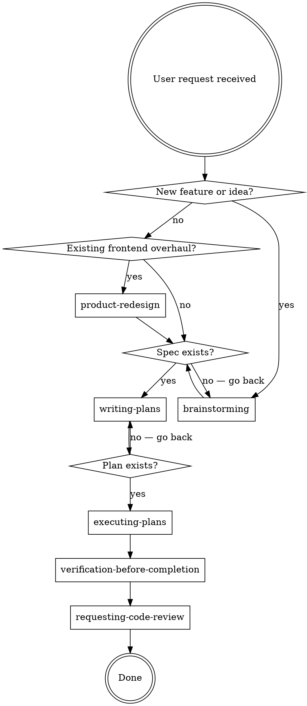

<SUBAGENT-STOP>
If you were dispatched as a subagent to execute a specific task, skip this skill.
</SUBAGENT-STOP>

<EXTREMELY-IMPORTANT>
If you think there is even a 1% chance a skill might apply to what you are doing, you ABSOLUTELY MUST invoke the skill.

IF A SKILL APPLIES TO YOUR TASK, YOU DO NOT HAVE A CHOICE. YOU MUST USE IT.

This is not negotiable. This is not optional. You cannot rationalize your way out of this.
</EXTREMELY-IMPORTANT>

## Instruction Priority

UPP skills override default system prompt behavior, but **user instructions always take precedence**:

1. **User's explicit instructions** (CLAUDE.md, direct requests) — highest priority
2. **UPP skills** — override default system behavior where they conflict
3. **Default system prompt** — lowest priority

If CLAUDE.md says "don't use TDD" and a skill says "always use TDD," follow the user's instructions. The user is in control.

## How to Access Skills

Use the `Skill` tool. When you invoke a skill, its content is loaded and presented to you — follow it directly. Never use the Read tool on skill files.

# The Product Development Pipeline

UPP skills form a state machine. Know where you are, know what comes next.

### Main Pipeline
brainstorming → writing-plans → executing-plans → verification-before-completion

Each phase depends on the output of the previous one. **Never skip phases.** Brainstorming produces the spec. Writing-plans consumes the spec. Executing-plans follows the plan. Verification confirms the work. Skipping a phase doesn't save time — it creates rework that costs 2-5x more than doing the phase would have.

### Branches
- Existing frontend redesign? → **product-redesign** (diagnosis before treatment, produces spec, feeds into writing-plans)
- Agentic product detected? → **agentic-ux-patterns** (informs brainstorming discovery + execution implementation)

### During Execution
- Each task: **test-driven-development** (write test first, implement to pass, refactor)
- Bug or failure mid-task: **systematic-debugging** (pause execution → diagnose → fix → resume)
- Frontend component work: **design-system-enforcer** (auto via hooks on Write/Edit, invoke explicitly for complex UI)

### Exit Gate
**verification-before-completion** → **requesting-code-review** → Done

Never claim "done" without passing through both gates. Verification confirms YOUR work is correct. Code review confirms SOMEONE ELSE agrees.

### Meta Skills (Any Phase)
- 2+ independent tasks, no shared state: **dispatching-parallel-agents**
- Creating or editing a skill: **writing-skills**
- Review feedback received: **receiving-code-review** (verify before implementing)

# Using Skills

## The Rule

**Invoke relevant or requested skills BEFORE any response or action.** Even a 1% chance a skill might apply means you invoke it. Period.

If an invoked skill turns out to be wrong for the situation, you don't need to use it. A wrong invocation costs 5 seconds. A skipped skill costs hours of rework. The math is not close.

## UPP Skill Routing

These are NOT suggestions. Each row is a MANDATORY checkpoint.

| Situation | Skill | MUST invoke | Why — what goes wrong if you skip |
|-----------|-------|-------------|-----------------------------------|
| Building something new, exploring an idea | brainstorming | Before ANY implementation. No exceptions. No "let me just scaffold first." No "let me explore the codebase first." | You'll build the wrong thing. Unexamined assumptions cause 2-5x rework. The 80% iceberg — failure modes, edge cases, integration ripples — only surfaces through structured discovery |
| Overhauling existing frontend design | product-redesign | Before touching any existing frontend CSS, components, or layout | Reskinning without diagnosis creates Frankenstein UIs. Audit what exists, identify pain, THEN prototype the target |
| Have a spec, need implementation plan | writing-plans | After brainstorming produces an approved spec. Never skip straight to code | Unplanned implementation produces spaghetti. Plans create bite-sized, test-first tasks with clear file targets and design-aware ordering |
| Have a plan, need to execute it | executing-plans | After writing-plans creates a plan. This is the ONLY path to implementation | Freestyling implementation skips the three-gate review: spec compliance, code quality, design compliance. Every gate catches different defects |
| Writing frontend components | design-system-enforcer | Auto via hooks on Write/Edit. Invoke explicitly for deep grounding before complex UI work | Without grounding, you'll reinvent components that exist, violate the color palette, break accessibility, ignore DESIGN.md tokens. The hooks inject tokens automatically — invoke the full skill when you need the complete picture |
| Building agentic UI patterns | agentic-ux-patterns | During brainstorming if product involves agents, AND during implementation of streaming/approval/error UI | Agentic UX has unique failure modes — streaming interruption, approval flows, error recovery mid-stream — that generic UI patterns don't cover. Miss these and the product breaks in production |
| Implementing any feature or bugfix | test-driven-development | Before writing ANY implementation code. Write the test FIRST. Not after. Not alongside. FIRST | The test defines what "done" means. Without it, you're guessing when to stop. Implementation without tests is unverifiable. Tests written after are confirmation bias — they test what you built, not what you should have built |
| Encountering a bug, test failure, unexpected behavior | systematic-debugging | IMMEDIATELY when something fails. Before proposing ANY fix. Before saying "try this" | Guess-and-patch is the #1 time waster. Each failed guess erodes trust and wastes context. Observe → hypothesize → test hypotheses → fix root cause. Never skip to "try this" |
| About to claim work is complete or fixed | verification-before-completion | Before ANY completion claim, commit, or PR. Non-negotiable. No exceptions | "It should work" is not evidence. "The tests should pass" is not evidence. Run the commands. Read the output. If you didn't verify, you don't know. If you don't know, you don't claim done |
| Completing a task, want quality check | requesting-code-review | After implementation, before merge | You are blind to your own mistakes. Every developer is. Independent review catches design violations, missing tests, edge cases you didn't think of because you were too close to the code |
| Received code review feedback | receiving-code-review | Before implementing ANY review suggestion | Don't blindly comply. Don't performatively agree. Verify the feedback is technically correct before implementing. Bad review advice implemented uncritically creates new bugs that are harder to find because "it was reviewed" |
| 2+ independent tasks with no shared state | dispatching-parallel-agents | When you identify 2+ tasks that can run without shared state or sequential dependencies | Sequential execution of independent work wastes time. Parallel dispatch with full context per agent. But ONLY when tasks are truly independent — shared state means sequential |
| Creating or editing a skill | writing-skills | Before writing or modifying any skill file | Skills are products — they corrupt every session they touch if written badly. Pressure testing, rationalization resistance, deployment methodology. A bad skill is worse than no skill |

**If you're unsure whether a skill applies: invoke it.** A wrong invocation costs 5 seconds. A skipped skill costs hours of rework. This is not a close call.

**Design awareness:** If the project has frontend code, check for DESIGN.md. If absent and building greenfield, brainstorming will establish it via prototype-first.

## Red Flags

These thoughts mean STOP — you're rationalizing. Every single one of these has caused real failures:

| Thought | Reality | Do This Instead |
|---------|---------|-----------------|
| "This is just a simple question" | Questions are tasks. Check for skills | Scan the routing table. If anything matches even 1%, invoke it |
| "I need more context first" | Skill check comes BEFORE clarifying questions. Always | Invoke the skill. It will TELL you how to gather context |
| "Let me explore the codebase first" | Skills tell you HOW to explore. Check first | Invoke brainstorming or debugging — they structure exploration for you |
| "I can check git/files quickly" | Files lack conversation context. Check for skills | The skill adds structure and methodology that raw file reads don't provide |
| "Let me gather information first" | Skills tell you HOW to gather information | The skill IS your information-gathering protocol. Use it |
| "This doesn't need a formal skill" | If a skill exists for this situation, use it. No judgment calls | Invoke it. If it turns out to be wrong, you lose 5 seconds. If you skip and it was right, you lose hours |
| "I remember this skill" | Skills evolve. Your memory of a skill is stale the moment you recall it | Always invoke via Skill tool. Never work from memory of a skill's content. Ever |
| "This doesn't count as a task" | If you're about to DO something, it's a task. Action = task | Check the routing table. If a skill governs HOW to do this action, invoke it |
| "The skill is overkill" | Simple things become complex. You don't know the complexity until you're in it | The skill scales to complexity. It won't slow you down on simple tasks. It WILL save you on complex ones |
| "I'll just do this one thing first" | One unauthorized action leads to another. Scope creep starts with "just one thing" | Check BEFORE doing anything. One thing becomes two becomes a mess |
| "This feels productive" | Undisciplined action feels productive but produces rework. Skills prevent this | Productivity without structure is rework waiting to happen. Invoke the skill |
| "I know what that means" | Knowing the concept ≠ using the skill. The skill has checklists, protocols, gates that general knowledge doesn't | Invoke it. The specifics matter. Your general knowledge misses the specifics |

## Skill Priority

When multiple skills could apply, use this order:

1. **Process skills first** (brainstorming, executing-plans) — these determine HOW to approach the task
2. **Domain skills second** (design-system-enforcer, agentic-ux-patterns) — these guide specific aspects during execution

"Let's build X" → brainstorming first, then domain skills during implementation.
"Execute this plan" → executing-plans, which handles review and verification.

**Pipeline position matters.** Don't invoke executing-plans before writing-plans. Don't invoke writing-plans before brainstorming has produced a spec. Don't invoke verification before there's something to verify. The pipeline exists because each phase depends on the output of the previous one. Skipping phases doesn't save time — it creates rework.

## Skill Types

**Rigid** (brainstorming, executing-plans, test-driven-development, systematic-debugging, verification-before-completion): Follow exactly. These encode hard-won discipline. Don't adapt, don't shortcut, don't "just this once" skip a step. The discipline IS the value.

**Flexible** (agentic-ux-patterns, design-system-enforcer): Adapt principles to context. The patterns guide, the specifics vary per project.

The skill itself tells you which type it is. When in doubt, treat it as rigid. It's safer to over-follow than to under-follow.

## User Instructions

Instructions say WHAT, not HOW. "Add X" or "Fix Y" doesn't mean skip workflows. The user tells you the destination. UPP skills are the route.

User can explicitly override: "skip brainstorming", "just fix it without the debugging skill", "don't use TDD for this." That's their prerogative — user instructions always take precedence.

But YOUR default is always to follow the skill pipeline. Never skip on your own initiative. Never rationalize that "this time is different." Never decide that a skill doesn't apply without invoking it first. The user overrides. You don't.

## Skill Awareness Signals

Don't wait for the user to name a skill. Recognize these signals and check:

| Signal you detect | Skill to check | Why this signal matters |
|-------------------|---------------|----------------------|
| Error, failure, unexpected output, test red, stack trace | systematic-debugging | Something broke. Diagnose before guessing |
| "Build", "create", "add feature", "new project", any creation intent | brainstorming | New work has unknowns. Surface them first |
| "Done", "ship it", "create PR", about to commit, about to claim completion | verification-before-completion | You're about to make a claim. Back it with evidence |
| Spec exists, requirements discussed, discovery complete | writing-plans | Discovery is done. Structure the implementation |
| Plan exists, tasks defined, ready to build | executing-plans | Don't freestyle. Follow the plan through execution |
| Frontend file touched, component created, CSS/styling work | design-system-enforcer | Design tokens and component library must be respected |
| Agent output, streaming UI, approval flow, JSON render mentioned | agentic-ux-patterns | Agentic UX has failure modes generic UI doesn't |
| Review comments received, PR feedback, suggested changes | receiving-code-review | Verify before implementing. Don't blindly comply |
| Multiple independent tasks identified in a plan or request | dispatching-parallel-agents | Independent tasks should run in parallel, not sequential |
| Editing a .md skill file, discussing skill creation or improvement | writing-skills | Skills are products. Use the methodology |

### The Self-Check Habit

When you notice a signal from the table above, pause and ask yourself:

**"Is there a UPP skill for what I'm about to do?"**

- If yes → invoke it before proceeding. No exceptions
- If unsure → invoke it. The cost of a wrong invocation is near zero. The cost of a missed skill is enormous
- If no signal detected → continue naturally. Don't over-check. This is signal-based, not a per-message gate

This habit keeps skill awareness alive throughout the session — not just at the start. Compaction can strip context, long implementation chains can narrow focus, but signal recognition persists because it's a thinking pattern, not a lookup reference.
